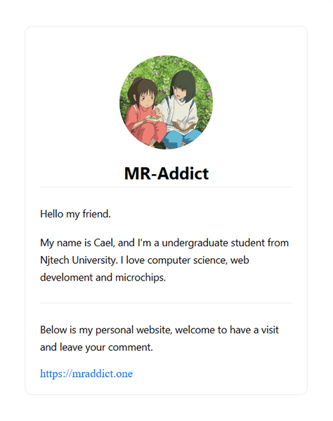
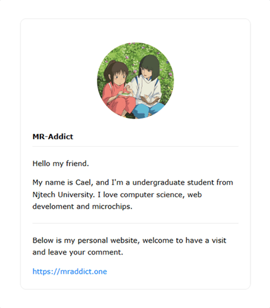

# React Email Preview

This is my first taste of [react-email](https://react.email/) writing an email with react.js and next.js. Which I think is cool.

## 1. Preview

|         Preview Email          |        Received Email        |
| :----------------------------: | :--------------------------: |
|  |  |

## 2. What I think

After the experience, I think the first react email offers more flexibility and options for us to write a beautiful email without much effort.

But I think it's still got a lot of work to do. In my opinion, it was a little bit hard to write code than actual react, and there is still a lot of css style not working.

After all, I still love it, react email would be on my first list if I got to write a good-looking email.

## 3. How to Use

Clone project:

```bash
git clone https://github.com/MR-Addict/react-email.git
```

Install packages:

```bash
npm install
```

Run dev

```bash
npm run dev
```
